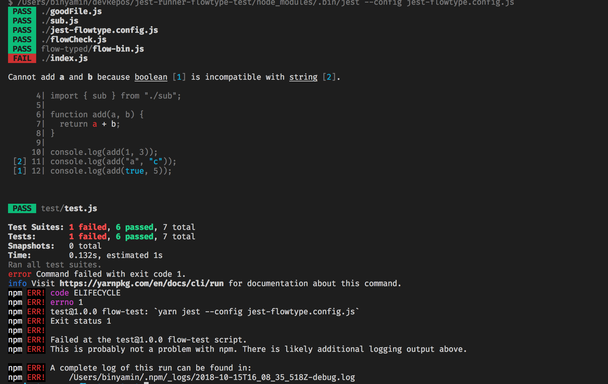

# NOTICE!

This project is not maintained anymore. It won't run with the latest Flow version and I don't have the time to fix it. Drop me a message if you want to maintain it or fix it to use the latest Flowtype version.

# Jest-Runner-Flowtype

An experimental Flowtype runner for Jest

You can learn more about Jest as a platform and Jest runners in the following video

[](https://www.youtube.com/watch?v=NtjyeojAOBs)

## Usage

### install

You need to have jest (version 21 or later) then install jest-runner-flowtype

```bash
yarn add --dev jest-runner-flowtype
```

### Configure

Now add jest runner flowtype to jest config

You can do that either in your package.json

```json
{
  "jest": {
    "runner": "jest-runner-flowtype"
  }
}
```

Or in jest.config.js

```js
module.exports = {
  runner: "jest-runner-flowtype"
};
```

### Run

Now you can run jest and flowtype runner will be called.

```bash
yarn jest
```

### Multiple runners

Most of the times it make sense to have multiple configurations as you still want Jest to run your tests

You can have multiple configurations. Just have another config object in other file (Let's say - flow-jest.config.js) and set the following script on your package.json

```json
{
  "scripts": {
    "flow-runner": "yarn jest --config flow-jest.config.js"
  }
}
```

Now run it with

```bash
yarn flow-runner
```

The following screenshot is a sample output for failed run.


